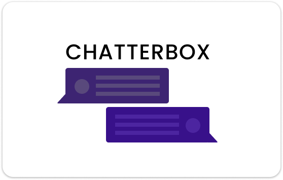

# CHATTERBOX

    

## Description

A simple NodeJs backend application for chatterbox.

### Installation

Follow the following steps to get started with the Chatterbox backend.

### Prerequisites

You must have the following set up on your local machine.

1. [NodeJS](https://nodejs.org/en/)
2. [Nodemon](https://www.npmjs.com/package/nodemon) - For Development purposes only [Not a required module.]
3. [Chatterbox React Client](#)

### Setup

1. Clone this repository.
2. Install all dependencies
   `npm install`

### Usage

To get started on your local machine, run the following command.

`npm run dev`

### Contributing

Feel free to fork this repository and create pull requests if you see fit.

## Contacts

Feel free to contact me if you have any questions.

Email: dzabalamacheza@gmail.com

Twitter: [@chezaguy](https://twitter.com/chezaguy)

Github: @Cheza-Dzabala
